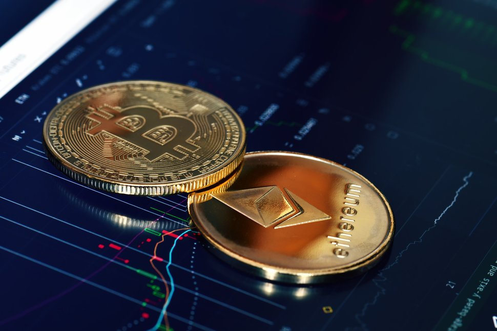
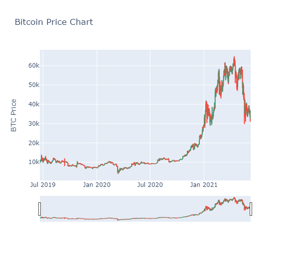

# Big Whale Madness - Bitcoin
Team Members: William Brooks, Manolo Serrano, Stephen Bledsoe
____

___
# Sample size - Crypto Exchange Data Flow 2020-2021 Momentum
___
## Business Questions:
###   Is Bitcoin worthy of investment?
###   Manipulation in the market 2021?
###   How does Bitcoin Compare to Amazon and why should we compare the two?
###   Are there other Alternative coins to invest in?
###   How do these coins rank against Bitcoin?
###   Does Bitcoin have true value compared to the S&P 500?
###   Does Bitcoin have true value compared to Gold?

## Intro

* Bitcoin has been around as early as 2009 with the emphasis of blockchain technology under the use case of Proof of Work. Proof of Work describes a system that requires significant amount of effort to perform at a high malicious use of power. Due to proof of work, Bitcoin and other Cryptocurrency transactions are processed peer-to-peer in a secure manner without the need for an intermediary party. Transactions are handled by miners who use an extreme amount of energy. In turn the more miners, the better for Bitcoin but worse for your average retail/institutional buyer who transacts with Bitcoin.

## Is Bitcoin Worthy of investment?

* In 2020, Due to the Pandemic, many retail investors looked for other alternatives for income due to job loss, fluctuation of the stock market, and financial hardships. At this time the second rise of Bitcoin was about to takeoff at the end of 2020. The image of the graph below shows how Bitcoin was stagnated until its breakout of a new All Time High in December 20 reaching nearly $29,000.00 on December 30th. Even though Bitcoin's price is somewhat inflated you are still able to invest using dollar cost averaging by investing in fractions of Bitcoin versus one Bitcoin. These fractional investments could eventually become an increase

## How does Bitcoin Compare to Amazon and why should we compare the two?

* Bitcoin Dominance has been around for the past 
 

